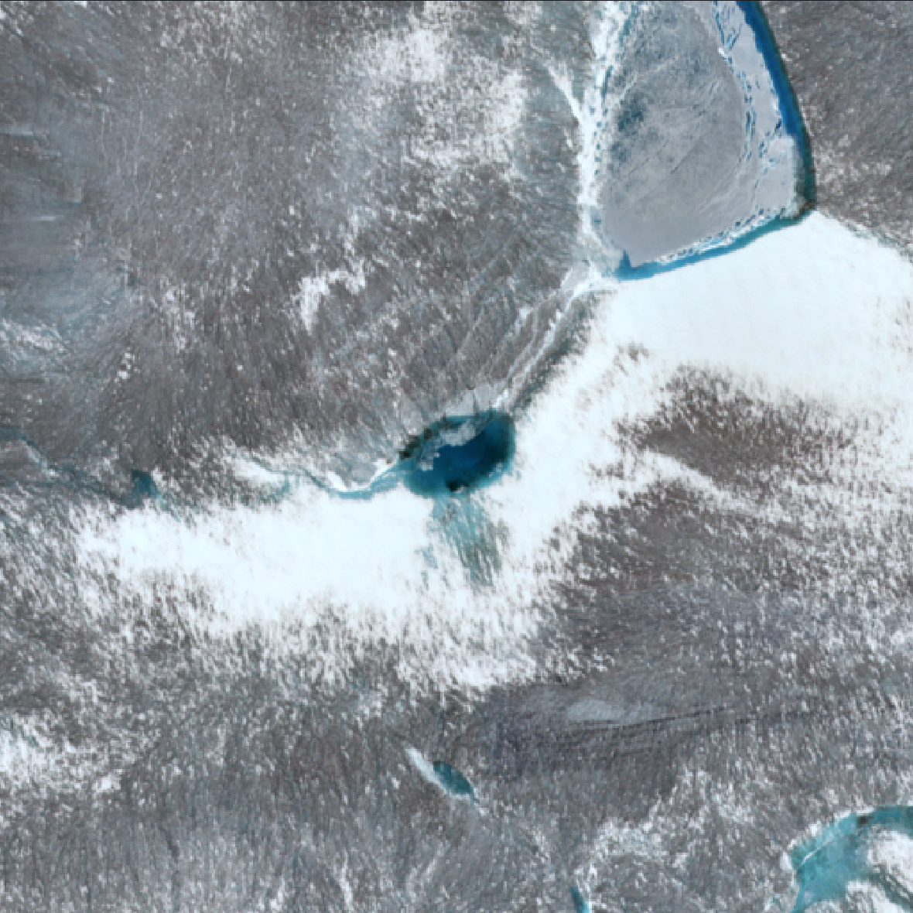
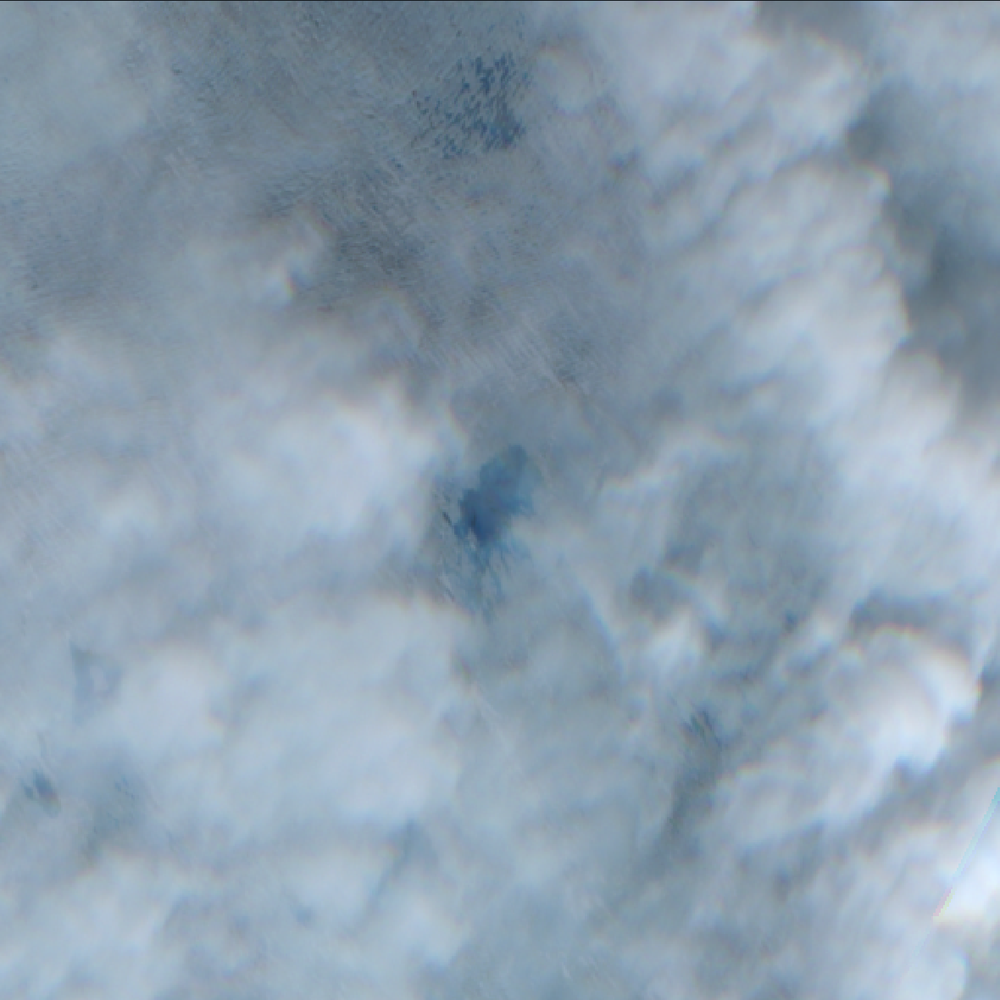

# cloudytile

NOTE: this repo is under active development...

`cloudytile` is a framework (with deep learning and classical cv options) for determining if a tile from a satellite imagery stack is too cloudy to be useful.  Because 'useful' is dependent on the specific use case, this framework provides flexibility for the user to determine the best algorithm for the use case at hand.

The end use of these classifications is as a soft input to a more complicated classification problem (e.g., see [YaoGroup/lake-vision](https://github.com/YaoGroup/lake-vision)), which can guide that network to pay more attention to the image tiles that are 'useful'.

## Tile Examples
<table>
  <tr>
    <th></th>
    <th> </th>
    <th> </th>
  </tr>
  <tr>
    <th align="right">useful</th>
    <td></td>
    <td></td>
  </tr>
  <tr>
    <th align="right">not useful</th>
    <td></td>
    <td></td>
  </tr>
</table>

Note that even though the second example of a 'useful' tile is notably cloudy, there is still useful information about the presence of a lake (e.g., we can see through the thin cloud layer and determine that the tile has a lake, and its rough extent).  This information is useful in downstream applications, such as lake detection and drainage classification.  If we were to use a strict cloud cut or other methods, we may erroneously ignore the utility of this tile.

## Model Results

