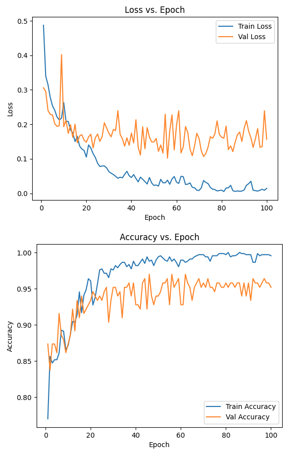
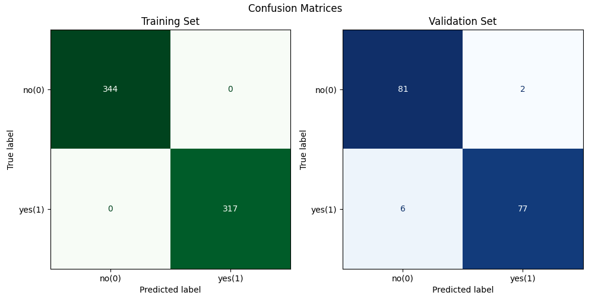

# cloudytile

NOTE: this repo is under active development...

`cloudytile` is a framework (with deep learning and classical cv options) for determining if a tile from a satellite imagery stack is too cloudy to be useful.  Because 'useful' is dependent on the specific use case, this framework provides flexibility for the user to determine the best algorithm for the use case at hand.

The end use of these classifications is as a soft input to a more complicated classification problem (e.g., see [YaoGroup/lake-vision](https://github.com/YaoGroup/lake-vision)), which can guide that network to pay more attention to the image tiles that are 'useful'.

## Model training examples

