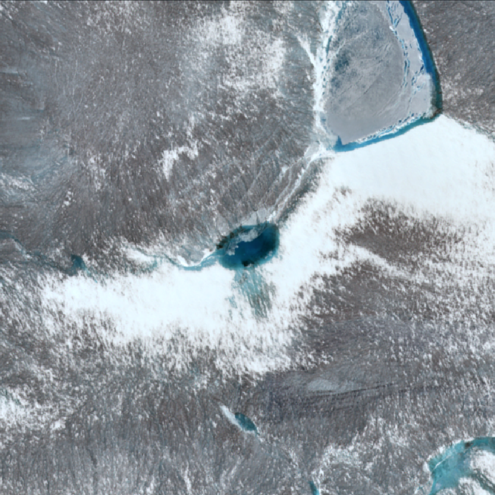
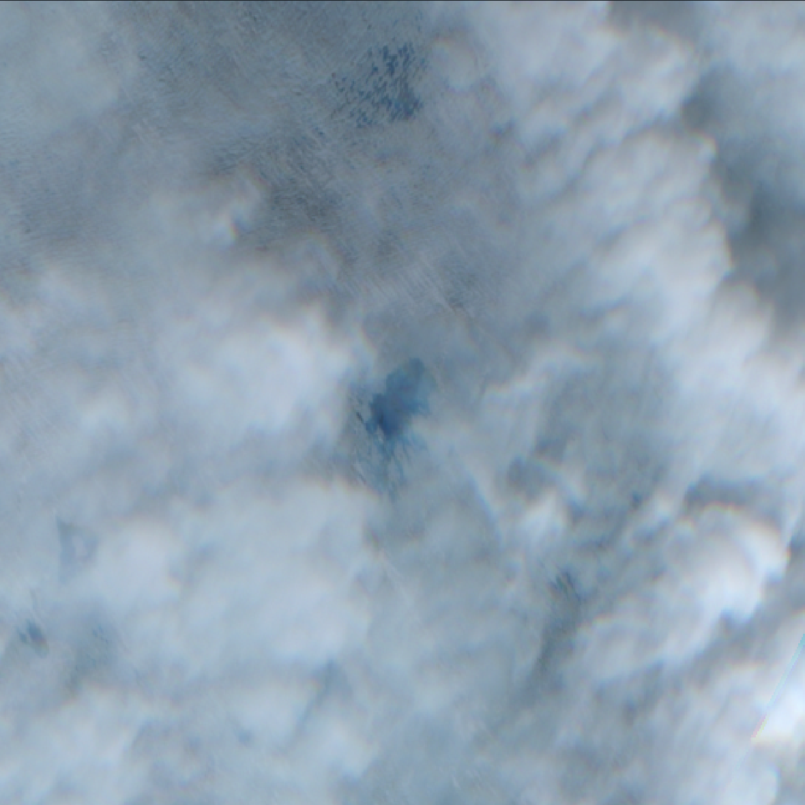
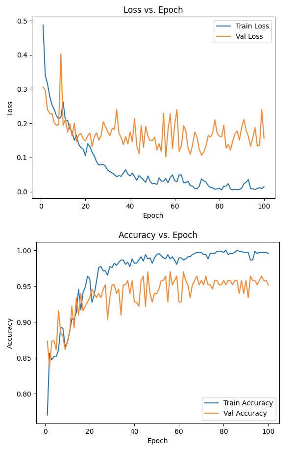
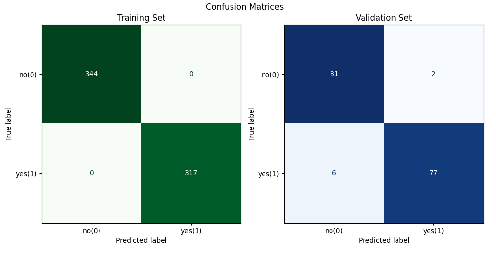

# cloudytile

`cloudytile` is a PyTorch-based binary classifier that determines whether satellite imagery tiles are "useful" or "not useful" based on cloud coverage and no-data pixels. It's designed as a preprocessing step for downstream tasks like lake drainage classification (see [YaoGroup/lake-vision](https://github.com/YaoGroup/lake-vision)).

## Tile Examples
<table>
  <tr>
    <th></th>
    <th> </th>
    <th> </th>
  </tr>
  <tr>
    <th align="right">useful</th>
    <td></td>
    <td></td>
  </tr>
  <tr>
    <th align="right">not useful</th>
    <td></td>
    <td></td>
  </tr>
</table>

Note that even though the second example of a 'useful' tile is notably cloudy, there is still useful information about the presence of a lake (e.g., we can see through the thin cloud layer and determine that the tile has a lake, and its rough extent). This information is useful in downstream applications, such as lake detection and drainage classification. If we were to use a strict cloud cut or other methods, we may erroneously ignore the utility of this tile.

## Repository Structure

```
cloudy-tile/
├── cloudytile/              # Main Python package (importable)
│   ├── __init__.py
│   ├── model.py             # CloudyTileCNN architecture
│   ├── data.py              # PyTorch Dataset and data splitting
│   ├── inference.py         # Model loading and prediction utilities
│   ├── training.py          # Training and evaluation functions
│   └── preprocessing.py     # NetCDF to JPG extraction
├── engine/                  # Runnable scripts (entry points)
│   ├── preprocessing/
│   │   └── extract_jpgs.py
│   ├── training/
│   │   ├── run_training.py           # Main training script
│   │   ├── run_spectral_array.sh     # SLURM array job for spectral band sweep
│   │   ├── train_top3_models.sh      # Train and save top 3 spectral models
│   │   ├── run_sweep.sh              # SLURM job for wandb sweeps
│   │   └── sweep.yaml                # Hyperparameter sweep configuration
│   ├── inference/
│   │   └── run_inference_lakes.sh    # Run inference on lake NC files
│   └── labeling/
│       └── export_labelbox.py
├── labels.csv               # Exported labels from Labelbox
└── assets/                  # Documentation images
```

## Installation

```bash
git clone https://github.com/jharlanr/cloudy-tile.git
cd cloudy-tile
pip install -e .
```

### Dependencies
- PyTorch, torchvision
- xarray (NetCDF handling)
- PIL/Pillow (image I/O)
- pandas, numpy
- scikit-learn (data splitting)
- wandb (optional, for experiment tracking)
- labelbox (optional, for annotation fetching)

## Usage

### Training

**Local training:**
```bash
python engine/training/run_training.py \
    --labels_csv labels.csv \
    --image_dir /path/to/jpg_tiles \
    --epochs 30 \
    --batch_size 32 \
    --lr 1e-3 \
    --optimize_metric precision \
    --save_path best_model.pth
```

**Key training arguments:**
| Argument | Default | Description |
|----------|---------|-------------|
| `--epochs` | 20 | Number of training epochs |
| `--batch_size` | 32 | Batch size |
| `--lr` | 1e-3 | Learning rate |
| `--img_size` | 512 | Input image size |
| `--channels` | [16, 32, 64] | Conv layer channel sizes |
| `--fc_layers` | [128] | Fully connected layer sizes |
| `--optimize_metric` | precision | Metric for model selection (accuracy, precision, recall, f1, auc) |
| `--use_scheduler` | False | Use learning rate scheduler |
| `--weight_decay` | 0.0 | L2 regularization |

### Hyperparameter Sweeps (wandb)

1. **Create sweep** (from login node with internet):
   ```bash
   cd engine/training
   wandb sweep sweep.yaml
   # Returns: Created sweep with ID: <username>/<project>/<sweep_id>
   ```

2. **Run sweep agent**:
   ```bash
   # Local
   wandb agent <sweep_id>

   # On Sherlock (SLURM)
   sbatch run_sweep.sh <username>/<project>/<sweep_id>
   ```

3. **Sync offline runs** (if using offline mode):
   ```bash
   wandb sync wandb/offline-run-*
   ```

### Inference

```python
from cloudytile.inference import load_model, predict_from_nc, add_cloudy_seq_to_nc, process_directory

# Load a trained model
model = load_model(
    weights_path="cloudytile_rgb.pth",
    img_size=(512, 512),
    in_channels=3,  # Must match training (3 for RGB, 4 for RGBN, etc.)
)

# Get predictions for all timesteps in a NetCDF file
predictions = predict_from_nc(
    model, ds,
    nc_channels=['red', 'green', 'blue'],
    band_stats=band_stats_dict,  # Per-band normalization
)

# Add cloudy_seq variable to NetCDF for use in lake-vision
add_cloudy_seq_to_nc(
    nc_path="tile.nc",
    model=model,
    nc_channels=['red', 'green', 'blue'],
    band_stats=band_stats_dict,
    var_name='cloudy_seq_rgb',  # Custom output variable name
)

# Process entire directory (batch inference)
process_directory(
    nc_dir="/path/to/input/files",
    model_path="cloudytile_rgb.pth",
    nc_channels=['red', 'green', 'blue'],
    band_stats_path="band_stats.json",
    var_name='cloudy_seq_rgb',
    output_dir="/path/to/output/files",  # Optional: write to separate directory
)
```

### Data Preprocessing

**Extract JPGs from NetCDF timestacks:**
```python
from cloudytile.preprocessing import extract_frames_from_directory

extract_frames_from_directory(
    nc_dir="/path/to/netcdf_files",
    output_dir="/path/to/jpg_output",
    skip_existing=True
)
```

### Labeling

Labels are exported from Labelbox:
```bash
export LABELBOX_API_KEY="your_key"
python engine/labeling/export_labelbox.py --output labels.csv

# Reuse existing export task (faster):
python engine/labeling/export_labelbox.py --task_id <task_id> --output labels.csv
```

## Model Architecture

`CloudyTileCNN` is a simple CNN with configurable architecture:
- **Input**: Multi-spectral images, shape [B, C, H, W] where C depends on band configuration
- **Conv layers**: Configurable channels (default: [16, 32, 64])
- **FC layers**: Configurable sizes (default: [128])
- **Output**: Logits (use sigmoid for probabilities)

### Supported Spectral Bands

The model supports various Sentinel-2 band combinations via the `in_channels` parameter:
- `red`, `green`, `blue` (visible)
- `nir` (near-infrared)
- `swir16` (SWIR Band 11, 1.6μm)
- `swir22` (SWIR Band 12, 2.2μm)

**Top-performing band combinations** (from spectral sweep):
1. **RGB** (`red,green,blue`) - 3 channels
2. **RGB+NIR** (`red,green,blue,nir`) - 4 channels
3. **B+NIR+SWIR16** (`blue,nir,swir16`) - 3 channels

### Band Statistics (Normalization)

For multi-spectral models, per-band mean/std normalization is recommended. The `band_stats.json` file contains precomputed statistics:

```json
{
    "red": {"mean": 1234.5, "std": 567.8},
    "green": {"mean": 1100.2, "std": 498.3},
    "blue": {"mean": 900.1, "std": 412.5},
    "nir": {"mean": 2100.3, "std": 890.2},
    "swir16": {"mean": 1500.7, "std": 650.4},
    "swir22": {"mean": 800.9, "std": 380.1}
}
```

On Sherlock: `/oak/stanford/groups/cyaolai/JoshRines/data/cloudytile/band_stats.json`

## Model Results



## HPC (Sherlock) Setup

For Stanford Sherlock users, the training scripts are configured for the `serc` partition:

```bash
# Single training run
sbatch engine/training/run_training.sh

# Hyperparameter sweep (after creating sweep on login node)
sbatch engine/training/run_sweep.sh <sweep_id>
```

Compute nodes don't have internet access, so wandb runs in offline mode. Sync results from a login node after jobs complete.

## Related Projects

- [YaoGroup/lake-vision](https://github.com/YaoGroup/lake-vision) - Downstream lake detection that consumes `cloudy_seq` outputs

## How to Contribute

If you would like to add new functionality, we welcome contributions as pull requests on [our Github repo](https://github.com/jharlanr/cloudy-tile).

To report bugs or request features, please [open an issue on GitHub](https://github.com/jharlanr/cloudy-tile/issues).
